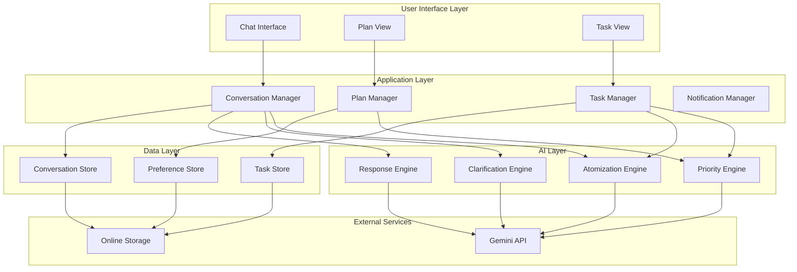

# Design Document: Atomize Core

## Overview

Atomize is a Gemini-powered anti-procrastination assistant that transforms messy task inputs into actionable, prioritized micro-tasks. The system follows a "simple outside, complex inside" philosophy – users interact through natural conversation while sophisticated AI handles task decomposition, prioritization, and adaptive planning.

The architecture is designed around three core principles:
1. **Conversational First**: All interactions flow through a chat-like interface
2. **AI-Driven Intelligence**: Gemini handles parsing, atomization, and decision-making
3. **Append-Only Data**: Task history is preserved, modifications are explicit and minimal

## Architecture



### Layer Responsibilities

**User Interface Layer**: Minimal, clean interfaces focused on clarity over completeness. The Chat Interface is the primary interaction point; Plan View and Task View are read-optimized displays.

**Application Layer**: Orchestrates business logic, manages state, and coordinates between UI and AI layers. Enforces append-only data rules and explicit modification requirements.

**AI Layer**: Encapsulates all Gemini interactions. Each engine has a specific responsibility and can be tested independently.

**Data Layer**: Handles persistence with append-only semantics. All stores sync to online storage.

## Components and Interfaces

### 1. Conversation Manager

Handles all user input and orchestrates responses.

```typescript
interface ConversationManager {
  // Process user input and return appropriate response
  processInput(input: UserInput): Promise<ConversationResponse>;
  
  // Get conversation history for context
  getHistory(limit?: number): ConversationEntry[];
  
  // Clear conversation (not task data)
  clearConversation(): void;
}

interface UserInput {
  text: string;
  timestamp: Date;
  context?: {
    currentTaskId?: string;
    currentView?: 'chat' | 'plan' | 'task';
  };
}

interface ConversationResponse {
  type: 'message' | 'task_created' | 'task_updated' | 'clarification' | 'confirmation';
  message: string;
  tasks?: Task[];
  clarificationQuestions?: string[];
  suggestedActions?: QuickAction[];
}

interface QuickAction {
  label: string;
  action: string;
  taskId?: string;
}
```

### 2. Task Manager

Core task CRUD operations with append-only enforcement.

```typescript
interface TaskManager {
  // Create new task (always appends)
  createTask(input: TaskInput): Promise<Task>;
  
  // Get task by ID
  getTask(id: string): Task | null;
  
  // Update task (requires explicit user request)
  updateTask(id: string, updates: TaskUpdate, explicit: boolean): Promise<Task>;
  
  // Mark task complete (append completion record)
  completeTask(id: string): Promise<Task>;
  
  // Delete task (requires explicit user request)
  deleteTask(id: string, explicit: boolean): Promise<void>;
  
  // Get all tasks with optional filters
  getTasks(filter?: TaskFilter): Task[];
  
  // Get tasks for today's plan
  getTodayTasks(): Task[];
  
  // Get upcoming tasks (next 7 days)
  getUpcomingTasks(): Task[];
}

interface TaskInput {
  rawInput: string;
  parentId?: string;
  deadline?: Date;
  priority?: PriorityLevel;
}

interface TaskUpdate {
  title?: string;
  description?: string;
  deadline?: Date;
  priority?: PriorityLevel;
  scheduledDate?: Date;
  estimatedMinutes?: number;
}

interface TaskFilter {
  status?: TaskStatus[];
  priority?: PriorityLevel[];
  dateRange?: { start: Date; end: Date };
  parentId?: string;
}
```

### 3. Task Data Model

```typescript
interface Task {
  id: string;
  createdAt: Date;
  updatedAt: Date;
  
  // Content
  title: string;
  description?: string;
  rawInput: string;  // Original user input preserved
  
  // Hierarchy
  parentId?: string;
  childIds: string[];
  
  // Scheduling
  deadline?: Date;
  scheduledDate?: Date;
  estimatedMinutes?: number;
  
  // Classification
  priority: PriorityLevel;
  priorityReason: string;  // Why this priority was assigned
  status: TaskStatus;
  
  // Context preservation
  context: TaskContext;
  
  // History (append-only)
  history: TaskHistoryEntry[];
}

type PriorityLevel = 'high' | 'medium' | 'low';

type TaskStatus = 'pending' | 'in_progress' | 'completed' | 'deferred' | 'archived';

interface TaskContext {
  originalGoal?: string;
  parentContext?: string;
  notes: string[];
  relatedTaskIds: string[];
}

interface TaskHistoryEntry {
  timestamp: Date;
  action: 'created' | 'updated' | 'completed' | 'deferred' | 'rescheduled';
  details: string;
  previousValue?: any;
  newValue?: any;
}
```

### 4. Atomization Engine

Breaks down tasks into micro-tasks using Gemini.

```typescript
interface AtomizationEngine {
  // Break down a task into micro-tasks
  atomize(task: Task): Promise<AtomizationResult>;
  
  // Suggest minimum viable progress for a task
  suggestMVP(task: Task): Promise<string>;
  
  // Estimate time for a task
  estimateTime(task: Task): Promise<number>;
}

interface AtomizationResult {
  microTasks: MicroTaskSuggestion[];
  dependencies: Dependency[];
  parallelGroups: string[][];  // Groups of task IDs that can run in parallel
  mvpSuggestion?: string;
}

interface MicroTaskSuggestion {
  title: string;
  description?: string;
  estimatedMinutes: number;
  dependsOn: string[];  // IDs of tasks this depends on
  isParallelizable: boolean;
}

interface Dependency {
  fromTaskId: string;
  toTaskId: string;
  type: 'blocks' | 'informs';
}
```

### 5. Priority Engine

Classifies and orders tasks by priority.

```typescript
interface PriorityEngine {
  // Calculate priority for a single task
  calculatePriority(task: Task): Promise<PriorityResult>;
  
  // Reorder tasks by priority
  prioritizeTasks(tasks: Task[]): Promise<Task[]>;
  
  // Get next recommended task
  getNextTask(tasks: Task[]): Task | null;
}

interface PriorityResult {
  level: PriorityLevel;
  reason: string;
  score: number;  // 0-100 for fine-grained ordering
  factors: PriorityFactor[];
}

interface PriorityFactor {
  name: string;
  weight: number;
  value: number;
  explanation: string;
}
```

### 6. Clarification Engine

Handles ambiguous inputs by generating clarifying questions.

```typescript
interface ClarificationEngine {
  // Analyze input and determine if clarification needed
  needsClarification(input: string): Promise<ClarificationAnalysis>;
  
  // Generate clarifying questions (max 3)
  generateQuestions(input: string, context?: Task[]): Promise<string[]>;
  
  // Process clarification response and update understanding
  processClarification(
    originalInput: string,
    question: string,
    answer: string
  ): Promise<ClarifiedInput>;
}

interface ClarificationAnalysis {
  needsClarification: boolean;
  missingInfo: string[];
  ambiguities: string[];
  confidence: number;  // 0-1
}

interface ClarifiedInput {
  title: string;
  description?: string;
  deadline?: Date;
  priority?: PriorityLevel;
  estimatedMinutes?: number;
  confidence: number;
}
```

### 7. Plan Manager

Manages the daily/weekly plan view.

```typescript
interface PlanManager {
  // Get today's plan
  getTodayPlan(): Plan;
  
  // Get weekly plan
  getWeekPlan(): Plan[];
  
  // Reschedule a task
  rescheduleTask(taskId: string, newDate: Date): Promise<void>;
  
  // Defer task to tomorrow
  deferTask(taskId: string): Promise<void>;
  
  // Adapt plan when circumstances change
  adaptPlan(trigger: AdaptationTrigger): Promise<PlanAdaptation>;
}

interface Plan {
  date: Date;
  tasks: Task[];
  completedCount: number;
  totalCount: number;
  estimatedMinutes: number;
}

interface AdaptationTrigger {
  type: 'task_completed' | 'task_deferred' | 'new_task' | 'deadline_changed' | 'time_passed';
  taskId?: string;
  details?: any;
}

interface PlanAdaptation {
  changes: PlanChange[];
  explanation: string;
}

interface PlanChange {
  taskId: string;
  changeType: 'rescheduled' | 'reprioritized' | 'removed';
  from?: any;
  to?: any;
  reason: string;
}
```

### 8. Notification Manager

Handles reminders and check-ins.

```typescript
interface NotificationManager {
  // Schedule a reminder
  scheduleReminder(taskId: string, time: Date): void;
  
  // Get pending notifications
  getPendingNotifications(): Notification[];
  
  // Snooze a notification
  snoozeNotification(notificationId: string, minutes: number): void;
  
  // Configure notification preferences
  setPreferences(prefs: NotificationPreferences): void;
}

interface Notification {
  id: string;
  taskId: string;
  type: 'reminder' | 'check_in' | 'celebration';
  message: string;
  scheduledTime: Date;
  status: 'pending' | 'sent' | 'snoozed' | 'dismissed';
}

interface NotificationPreferences {
  frequency: 'off' | 'minimal' | 'normal' | 'frequent';
  quietHours?: { start: string; end: string };
  celebrationsEnabled: boolean;
}
```

### 9. Response Engine

Generates natural, supportive responses.

```typescript
interface ResponseEngine {
  // Generate response for task creation
  generateTaskCreatedResponse(task: Task): Promise<string>;
  
  // Generate response for task completion
  generateCompletionResponse(task: Task, stats: DayStats): Promise<string>;
  
  // Generate check-in message
  generateCheckIn(task: Task): Promise<string>;
  
  // Generate celebration message
  generateCelebration(achievement: Achievement): Promise<string>;
  
  // Generate explanation for a decision
  generateExplanation(decision: Decision): Promise<string>;
}

interface DayStats {
  completedToday: number;
  totalToday: number;
  streak: number;
}

interface Achievement {
  type: 'task_complete' | 'day_complete' | 'streak' | 'milestone';
  details: any;
}

interface Decision {
  type: 'priority' | 'schedule' | 'atomization';
  input: any;
  output: any;
}
```

## Data Models

### Storage Schema

```typescript
// Online storage collections

interface TaskDocument {
  id: string;
  userId: string;
  task: Task;
  version: number;
  createdAt: Date;
  updatedAt: Date;
}

interface ConversationDocument {
  id: string;
  userId: string;
  entries: ConversationEntry[];
  createdAt: Date;
  updatedAt: Date;
}

interface ConversationEntry {
  id: string;
  timestamp: Date;
  role: 'user' | 'assistant';
  content: string;
  relatedTaskIds: string[];
}

interface UserPreferencesDocument {
  userId: string;
  notifications: NotificationPreferences;
  workingHours?: { start: string; end: string };
  timezone: string;
  createdAt: Date;
  updatedAt: Date;
}

interface ProgressDocument {
  userId: string;
  date: string;  // YYYY-MM-DD
  completedTaskIds: string[];
  deferredTaskIds: string[];
  streak: number;
  createdAt: Date;
}
```

### Append-Only Operations

All data modifications follow append-only semantics:

```typescript
// Example: Completing a task
async function completeTask(taskId: string): Promise<Task> {
  const task = await getTask(taskId);
  
  // Append history entry (never modify existing entries)
  const historyEntry: TaskHistoryEntry = {
    timestamp: new Date(),
    action: 'completed',
    details: 'Task marked as complete',
    previousValue: task.status,
    newValue: 'completed'
  };
  
  // Update task with new status and appended history
  const updatedTask = {
    ...task,
    status: 'completed' as TaskStatus,
    updatedAt: new Date(),
    history: [...task.history, historyEntry]
  };
  
  await saveTask(updatedTask);
  return updatedTask;
}

// Example: Explicit modification (requires explicit flag)
async function updateTask(
  taskId: string, 
  updates: TaskUpdate, 
  explicit: boolean
): Promise<Task> {
  if (!explicit) {
    throw new Error('Task modifications require explicit user request');
  }
  
  const task = await getTask(taskId);
  
  // Record what changed in history
  const changes: TaskHistoryEntry[] = [];
  for (const [key, value] of Object.entries(updates)) {
    if (task[key] !== value) {
      changes.push({
        timestamp: new Date(),
        action: 'updated',
        details: `${key} changed`,
        previousValue: task[key],
        newValue: value
      });
    }
  }
  
  const updatedTask = {
    ...task,
    ...updates,
    updatedAt: new Date(),
    history: [...task.history, ...changes]
  };
  
  await saveTask(updatedTask);
  return updatedTask;
}
```


## Correctness Properties

*A property is a characteristic or behavior that should hold true across all valid executions of a system—essentially, a formal statement about what the system should do. Properties serve as the bridge between human-readable specifications and machine-verifiable correctness guarantees.*

### Property 1: Input Acceptance

*For any* unstructured text input (brain dump, email paste, vague goal), the Task_Inbox SHALL accept and process it without throwing errors or requiring specific formatting.

**Validates: Requirements 1.1**

### Property 2: Multi-Task Extraction Completeness

*For any* input containing N distinct tasks (where N is determinable), the Atomization_Engine SHALL extract at least N task objects.

**Validates: Requirements 1.2**

### Property 3: Clarification Question Limit

*For any* ambiguous input requiring clarification, the Clarification_Loop SHALL generate at most 3 questions.

**Validates: Requirements 1.4**

### Property 4: Deadline Parsing Round-Trip

*For any* valid date, formatting it in natural language (e.g., "next Friday", "in 3 days") and then parsing it SHALL produce a date within 24 hours of the original.

**Validates: Requirements 1.6**

### Property 5: Micro-Task Time Bounds

*For any* task with estimated duration > 60 minutes, all resulting micro-tasks from atomization SHALL have estimatedMinutes in the range [15, 60].

**Validates: Requirements 2.1, 2.7**

### Property 6: Action-Oriented Phrasing

*For any* micro-task generated by the Atomization_Engine, the title SHALL start with a verb (from a defined verb dictionary).

**Validates: Requirements 2.2**

### Property 7: Dependency Ordering

*For any* set of micro-tasks with dependencies, if task B depends on task A, then A SHALL appear before B in the ordered list (topological sort).

**Validates: Requirements 2.3**

### Property 8: Parallelizable Marking

*For any* micro-task with an empty dependsOn array, isParallelizable SHALL be true.

**Validates: Requirements 2.4**

### Property 9: Time Estimate Presence

*For any* micro-task generated by the Atomization_Engine, estimatedMinutes SHALL be defined and greater than 0.

**Validates: Requirements 2.5**

### Property 10: MVP Suggestion for Deadlines

*For any* task with a defined deadline, the AtomizationResult SHALL include a non-empty mvpSuggestion.

**Validates: Requirements 2.6**

### Property 11: Hierarchy Preservation

*For any* task with parentId set, the parent task's childIds array SHALL contain the child task's id.

**Validates: Requirements 2.8, 14.1**

### Property 12: Priority Classification Validity

*For any* task in the system, priority SHALL be one of: 'high', 'medium', 'low'.

**Validates: Requirements 3.1**

### Property 13: Deadline-Based Priority

*For any* task with deadline within 24 hours, priority SHALL be 'high'. *For any* task with deadline within 7 days, priority SHALL be 'high' or 'medium'.

**Validates: Requirements 3.2, 3.3**

### Property 14: Priority Override

*For any* task where user explicitly sets priority to P, after the operation, task.priority SHALL equal P.

**Validates: Requirements 3.4**

### Property 15: Task Ordering

*For any* list of tasks returned by getTodayTasks() or getUpcomingTasks(), tasks SHALL be sorted by priority (high > medium > low) and then by deadline (earlier first).

**Validates: Requirements 3.5**

### Property 16: Priority Reasoning

*For any* task with an assigned priority, priorityReason SHALL be a non-empty string.

**Validates: Requirements 3.6, 16.1**

### Property 17: Next Task Suggestion

*For any* task completion where other pending tasks exist, getNextTask() SHALL return a non-null task.

**Validates: Requirements 4.1**

### Property 18: Defer Rescheduling

*For any* task that is deferred, the task's scheduledDate after deferral SHALL be later than the original scheduledDate.

**Validates: Requirements 4.2, 11.3**

### Property 19: High-Priority Accommodation

*For any* new task added with priority 'high', it SHALL appear before all 'medium' and 'low' priority tasks in getTodayTasks().

**Validates: Requirements 4.3**

### Property 20: Deadline Change Recalculation

*For any* task whose deadline is changed to within 24 hours, priority SHALL be recalculated to 'high'.

**Validates: Requirements 4.4**

### Property 21: Reschedule Explanation

*For any* PlanAdaptation returned by adaptPlan(), explanation SHALL be a non-empty string.

**Validates: Requirements 4.6**

### Property 22: Task Date Filtering

*For any* task with scheduledDate = today, it SHALL appear in getTodayTasks(). *For any* task with scheduledDate in next 7 days (not today), it SHALL appear in getUpcomingTasks().

**Validates: Requirements 6.1, 6.2, 6.3**

### Property 23: Today Task Limit

*For any* call to getTodayTasks(), the result SHALL contain at most 7 tasks.

**Validates: Requirements 6.4, 12.2**

### Property 24: Progress Tracking

*For any* Plan returned by getTodayPlan(), completedCount + (totalCount - completedCount) SHALL equal the total number of tasks for that day.

**Validates: Requirements 6.6**

### Property 25: Streak Calculation

*For any* sequence of N consecutive days with at least one completed task, the streak value SHALL be N.

**Validates: Requirements 8.3**

### Property 26: Data Persistence Round-Trip

*For any* task created via createTask(), calling getTask() with the same id SHALL return an equivalent task object.

**Validates: Requirements 9.1, 9.6**

### Property 27: Explicit Modification Required

*For any* call to updateTask() or deleteTask() with explicit=false, the operation SHALL throw an error or be rejected.

**Validates: Requirements 9.2, 9.4, 9.5**

### Property 28: Minimum Change Enforcement

*For any* call to updateTask() with explicit=true and updates containing field F, only field F (and updatedAt, history) SHALL differ between the original and updated task.

**Validates: Requirements 9.3**

### Property 29: Completed Task Retention

*For any* task marked as completed via completeTask(), calling getTask() with the same id SHALL return the task with status='completed'.

**Validates: Requirements 9.9**

### Property 30: JSON Export Round-Trip

*For any* set of tasks, exporting to JSON and parsing the result SHALL produce valid JSON that can be deserialized.

**Validates: Requirements 9.8**

### Property 31: Context Preservation

*For any* task created from user input, rawInput SHALL equal the original input string. *For any* task with parentId, context.parentContext SHALL be non-empty.

**Validates: Requirements 14.1, 14.2**

### Property 32: History Append-Only

*For any* task, after any operation, the history array length SHALL be >= the previous length (history is never truncated).

**Validates: Requirements 9.2, 11.4**

## Error Handling

### Input Errors

| Error Condition | Handling Strategy | User Message |
|----------------|-------------------|--------------|
| Empty input | Prompt for input | "What would you like to work on?" |
| Unparseable deadline | Ask for clarification | "I couldn't understand that deadline. Could you say it differently?" |
| AI service unavailable | Graceful degradation | "I'm having trouble thinking right now. Your task is saved and I'll process it shortly." |

### Data Errors

| Error Condition | Handling Strategy | User Message |
|----------------|-------------------|--------------|
| Task not found | Return null, log warning | "I couldn't find that task. It may have been removed." |
| Storage write failure | Retry with backoff, queue locally | "Saving... (will sync when connection is restored)" |
| Concurrent modification | Last-write-wins with history | (Silent merge, history preserved) |

### Validation Errors

| Error Condition | Handling Strategy | User Message |
|----------------|-------------------|--------------|
| Non-explicit modification attempt | Throw error | (Internal - should not reach user) |
| Invalid priority value | Default to 'medium' | (Silent correction) |
| Negative time estimate | Default to 30 minutes | (Silent correction with note in history) |

### AI Response Errors

| Error Condition | Handling Strategy | User Message |
|----------------|-------------------|--------------|
| Atomization produces no tasks | Return original as single task | "I'll keep this as one task for now. Let me know if you'd like me to break it down differently." |
| Priority calculation fails | Default to 'medium' with generic reason | (Silent fallback) |
| Response generation fails | Use template response | "Got it!" / "Task updated." |

## Testing Strategy

### Dual Testing Approach

This system requires both unit tests and property-based tests:

- **Unit tests**: Verify specific examples, edge cases, and error conditions
- **Property tests**: Verify universal properties across randomly generated inputs

### Property-Based Testing Configuration

- **Library**: fast-check (TypeScript)
- **Minimum iterations**: 100 per property test
- **Tag format**: `Feature: atomize-core, Property {number}: {property_text}`

### Test Categories

#### 1. Atomization Engine Tests

**Unit Tests:**
- Atomize a simple task ("Write report") produces reasonable breakdown
- Atomize a task with explicit subtasks preserves them
- Empty input handling
- Very long input handling (>10000 chars)

**Property Tests:**
- Property 5: Micro-task time bounds
- Property 6: Action-oriented phrasing
- Property 7: Dependency ordering
- Property 8: Parallelizable marking
- Property 9: Time estimate presence
- Property 10: MVP suggestion for deadlines

#### 2. Priority Engine Tests

**Unit Tests:**
- Task due in 1 hour gets high priority
- Task due in 3 days gets medium priority
- Task with no deadline gets low priority
- User override works correctly

**Property Tests:**
- Property 12: Priority classification validity
- Property 13: Deadline-based priority
- Property 14: Priority override
- Property 15: Task ordering
- Property 16: Priority reasoning

#### 3. Task Manager Tests

**Unit Tests:**
- Create task with all fields
- Create task with minimal fields
- Update task with explicit flag
- Update task without explicit flag (should fail)
- Delete task with explicit flag
- Complete task preserves data

**Property Tests:**
- Property 26: Data persistence round-trip
- Property 27: Explicit modification required
- Property 28: Minimum change enforcement
- Property 29: Completed task retention
- Property 31: Context preservation
- Property 32: History append-only

#### 4. Plan Manager Tests

**Unit Tests:**
- Get today's plan with no tasks
- Get today's plan with many tasks (verify limit)
- Defer task moves to tomorrow
- Add high-priority task reorders plan

**Property Tests:**
- Property 17: Next task suggestion
- Property 18: Defer rescheduling
- Property 19: High-priority accommodation
- Property 20: Deadline change recalculation
- Property 21: Reschedule explanation
- Property 22: Task date filtering
- Property 23: Today task limit
- Property 24: Progress tracking

#### 5. Clarification Engine Tests

**Unit Tests:**
- Clear input needs no clarification
- Ambiguous input generates questions
- Questions are relevant to missing info

**Property Tests:**
- Property 1: Input acceptance
- Property 3: Clarification question limit
- Property 4: Deadline parsing round-trip

#### 6. Data Layer Tests

**Unit Tests:**
- Save and retrieve task
- Export to JSON produces valid JSON
- Import from JSON restores tasks

**Property Tests:**
- Property 30: JSON export round-trip

#### 7. Progress Tracking Tests

**Unit Tests:**
- Streak starts at 1 on first completion
- Streak increments on consecutive days
- Streak resets after missed day
- Streak doesn't reset on same day

**Property Tests:**
- Property 25: Streak calculation

### Generator Strategies

For property-based tests, we need smart generators:

```typescript
// Task generator
const taskArbitrary = fc.record({
  title: fc.string({ minLength: 1, maxLength: 200 }),
  description: fc.option(fc.string({ maxLength: 1000 })),
  deadline: fc.option(fc.date({ min: new Date(), max: new Date(Date.now() + 30 * 24 * 60 * 60 * 1000) })),
  estimatedMinutes: fc.integer({ min: 5, max: 480 }),
  priority: fc.constantFrom('high', 'medium', 'low'),
});

// Natural language date generator
const naturalDateArbitrary = fc.oneof(
  fc.constant('tomorrow'),
  fc.constant('next week'),
  fc.constant('in 3 days'),
  fc.tuple(fc.constantFrom('next'), fc.constantFrom('Monday', 'Tuesday', 'Wednesday', 'Thursday', 'Friday')),
  fc.tuple(fc.integer({ min: 1, max: 30 }), fc.constantFrom('days', 'weeks'))
);

// Unstructured input generator
const brainDumpArbitrary = fc.array(
  fc.oneof(
    fc.string({ minLength: 5, maxLength: 100 }),
    fc.constantFrom(
      'need to finish the report',
      'call mom',
      'prepare for meeting tomorrow',
      'buy groceries - milk, eggs, bread'
    )
  ),
  { minLength: 1, maxLength: 10 }
).map(items => items.join('. '));
```

### Integration Test Scenarios

1. **End-to-end task flow**: Input → Clarification → Atomization → Prioritization → Plan
2. **Adaptation flow**: Create plan → Add urgent task → Verify reordering
3. **Completion flow**: Complete task → Verify next suggestion → Verify streak update
4. **Persistence flow**: Create tasks → "Restart" → Verify all tasks restored
